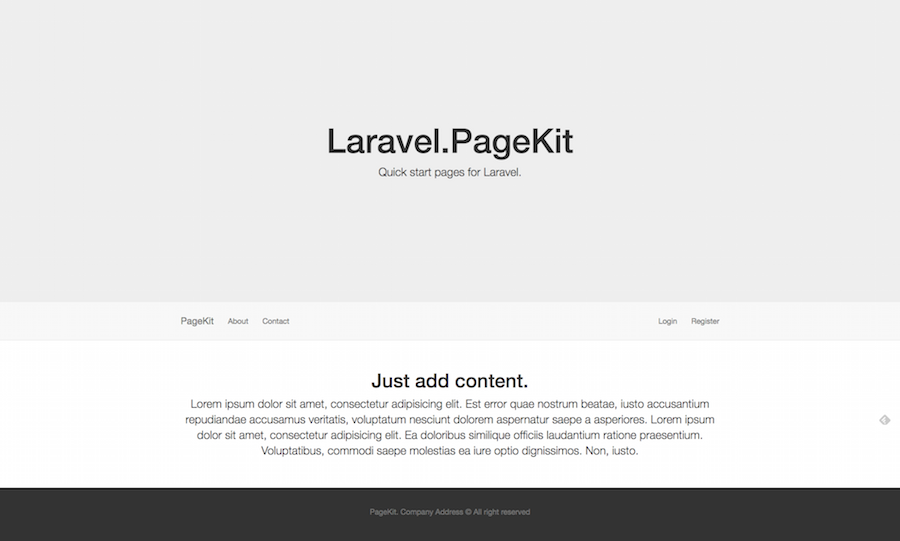
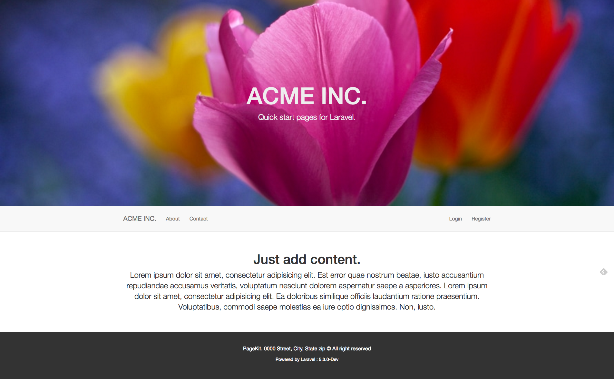

# Laravel UI.Pages (PageKit)

[](https://insight.sensiolabs.com/projects/2b15870b-8188-40ef-be16-96fea6a81bb9) [](https://www.codacy.com/app/shawnsandy04/ui-pages?utm_source=github.com&amp;utm_medium=referral&amp;utm_content=shawnsandy/ui-pages&amp;utm_campaign=Badge_Grade)

Laravel UI.Pages originally (PageKit) is a quick and easy way to upgrade the standard Laravel UI to with a clean and modern Starter website or default pages-- Home Abut Contact. Allowing you to deploy and launch a Laravel based static marketing / promotional site in minutes. Allowing you to focus on the design and development from the get go. 

> If you are looking for the original PageKit package you can still find it here at [Pagekit Original](https://github.com/shawnsandy/pagekit). I have moved PageKit to and new repository and changed the name to avoid conflict with PageKit, a php cms. I also used the opportunity to reboot to fix/update versioning to better meet semver standards. Sorry for the inconvenience I hope you find the package useful.




## Installation (traditional)

```

composer require shawnsandy/pagekit

```

__PageKitServiceProvider__

Add PageKitServiceProvider to the providers array in `config/app.php`

```php

ShawnSandy\PageKit\PageKitServiceProvider::class

```

__Publish the pagekit assets__

```php

php artisan vendor:publish --provider="ShawnSandy\PageKit\PageKitServiceProvider"

```

__Publish tags__

You can publish individual pagekit tags using `--tags`, *please note* that the `--pagekit-asssets` tag is required for page to display correctly. **BTW this is my preferred method of install**.

```php

php artisan vendor:publish --provider="ShawnSandy\PageKit\PageKitServiceProvider" --tag=name

```

or shortcut

```
php artisan vendor:publish --tag=name

```

**PageKit tags**

* `--tag=pagekit-assets` publishes your pagekit public assets / files to `/public/` 
* `--tag=pagekit-views` publishes your views to `vendor\pagekit`
* `--tag=pagekit-config` publishes `config\pagekit` to `config`

You can also use the `--force` to overwrite previously published files - `--tag=pagekit-assets --force`.

### Install for custom/package development 

To customize or use the package to start your own.

* Install [Laravel Packager](https://github.com/Jeroen-G/laravel-packager#laravel-packager) `composer require jeroen-g/laravel-packager`. Make sure to add the provider to your `config\app.php` provider array `eroenG\Packager\PackagerServiceProvider::class,`.
* Import the repository `php artisan packager:git https://github.com/shawnsandy/pagekit YourVendorName YourPackgeName`. This will create and download the package to `/packages/YourVendorName/YourPackageName`. It will also add your package to composer autoload parameter and add it to `config/app.php` provider array.
* Customize and push to you repo
* Enjoy
          


## Usage

Once installed correctly you should be able to goto  `http://yoursite.app/pagekit` 

### Default index page

Replace the default *welcome* page with the PageKit index by modifying your `app/Http/route.php` 

```php
Route::get('/', function () {
    return view('welcome');
});
```
*to*

```php
  Route::get('', function(){
        return view('page::index');
    });
```

### Custom Branding

You can custom brand pagekit by editing the values in the `config/pagekit.php` 

Turn branding on:

```php
'branding' => false,
``` 

Customize :

```php

'brand' => [
    'background-color' => '#FFFFFF',
    'header-background-color' => '#EEEEEE',
    'header-font-size' => '72px',
    'font-family' => '"Helvetica Neue", Helvetica, Arial, sans-serif',
    'header-font-color' => '#eee',
    'footer-background-color' => '#333333',
    'footer-color' => '#FFFFFF',
    'header-color' => '#EEEEEE',
    'text-color' => 'FFFFFF',
    'header-background-image' => "https://static.pexels.com/photos/129569/pexels-photo-129569-large.jpeg",
    'logo' => false
]

```

**Custom Header**

```php
header-background-image' => "https://static.pexels.com/photos/129569/pexels-photo-129569-large.jpeg",

```



## TODO

- [x] Contact form
- [ ] Social media links
- [ ] Add a static page editor
- [ ] Addon style selectors
- [ ] Custom artisan command

## Contributing

Fork it!
Create your feature branch: git checkout -b my-new-feature
Commit your changes: git commit -am 'Add some feature'
Push to the branch: git push origin my-new-feature
Submit a pull request :D
History

## Change Log

v.1.0.1

Renamed the package and mover the repository

[Pagekit Changelog](CHANGELOG.md)

## License

TODO: Modify [licence.md](LICENCE.md)


This project is licensed under the MIT License - see the [LICENSE.md](LICENSE.md) file for details
